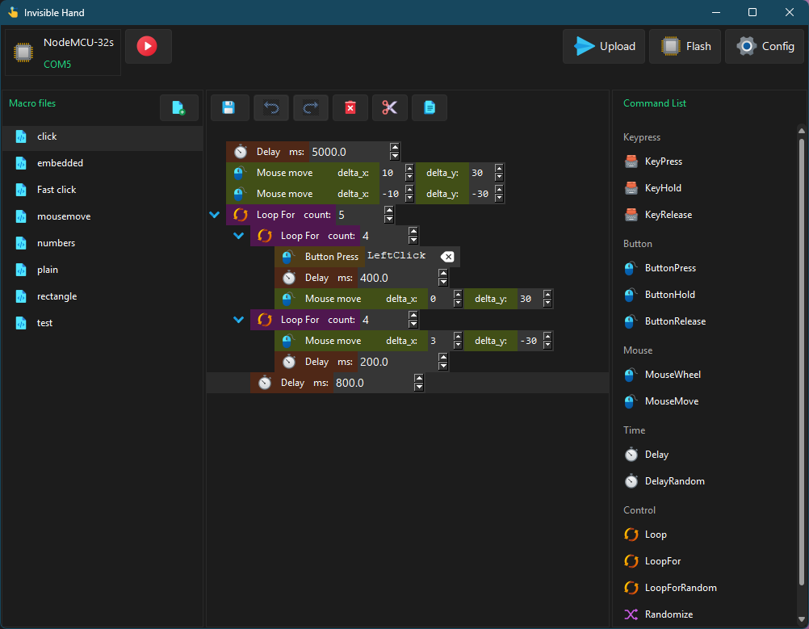

# Invisible Hand

[](LICENSE)
[](https://pypi.org/project/ivh/)
[](https://www.python.org/downloads/)
[](https://github.com/ObaraEmmanuel/invisible_hand/releases)

## Overview

**Invisible Hand** is a toolset that turns common microcontrollers (MCUs) — such as those in the ESP32 family — into programmable keyboards and mice. Depending on the capability of the MCU, this can be achieved over Bluetooth or USB.

For detailed documentation, check out the [wiki](https://github.com/ObaraEmmanuel/invisible_hand/wiki).



---

## Setup

### Windows

#### Installer

Download the Windows installer from the [releases page](https://github.com/ObaraEmmanuel/invisible_hand/releases) and run it. This includes start menu and desktop shortcuts.

#### Python

You can also install the Python package directly. Note that this method does **not** create start menu or desktop shortcuts.

```shell
pip install ivh
ivh start
```

---

### Linux

The only supported installation method on Linux is via the Python package. This requires **Python 3.10 or later**.

```shell
pip install ivh
ivh start
```

The desktop interface requires the `tk` and `imagetk` libraries. On Debian-based distros (Ubuntu, Mint, etc.), install them with:

```shell
sudo apt update
sudo apt install python3-tk python3-pil.imagetk
```

---

### macOS

> ⚠️ macOS is **not officially supported**. Installing the Python package *may* work, but is untested.

Make sure **Python 3.10+** is installed, then run:

```shell
pip install ivh
ivh start
```

---

## Preparing Your Hardware

You will need:

- An **ESP32 board** with onboard Bluetooth support
- A **data-capable USB cable** to connect your board to your PC (not a charge-only cable)

### Windows USB Drivers

On Windows, you may need to install a driver to enable serial communication with your board. The chip used varies by board model — check the small IC near the USB port and install the appropriate driver:

| Chip | Driver |
|------|--------|
| **CP210x** | [Installation guide — Random Nerd Tutorials](https://randomnerdtutorials.com/install-esp32-esp8266-usb-drivers-cp210x-windows/) |
| **CH34X** | [Installation guide — Adafruit](https://learn.adafruit.com/how-to-install-drivers-for-wch-usb-to-serial-chips-ch9102f-ch9102/windows-driver-installation) |
| **FTDI** | [VCP drivers — ftdichip.com](https://ftdichip.com/drivers/vcp-drivers/) |

> **Not sure which chip you have?** Check your board's documentation or look for a small square IC labelled with one of the chip names above near the USB connector.
